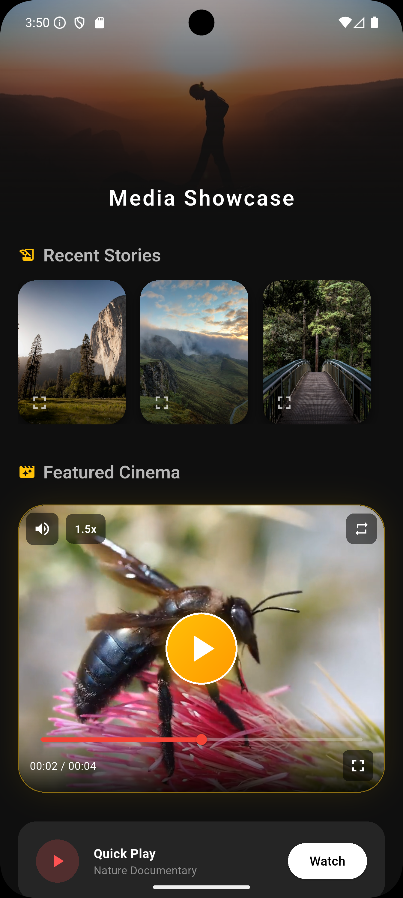

<p align="center">
  
</p>

<h1 align="center">📸 Photo Opener View</h1>

<p align="center">
  <strong>A powerful, highly customizable, and easy-to-use Flutter package for viewing images and videos with beautiful UI styles, animations, and gesture support.</strong>
</p>

<p align="center">
  <a href="https://pub.dev/packages/photo_opener_view"></a>
  <a href="https://opensource.org/licenses/MIT"></a>
  <a href="https://flutter.dev"></a>
  <a href="https://github.com/SatishParmar1/Photo_Opening_Package"></a>
</p>

---

## ✨ Features

### 📸 Advanced Image Viewer
- **Pinch-to-zoom** & **Double-tap zoom** (powered by `photo_view`)
- **Swipe-to-dismiss** gestures (Instagram/Facebook style)
- **Hero animation** support for seamless transitions
- Rotation support & customizable zoom limits

### 🖼️ Image Gallery
- Swipeable gallery with smooth page transitions
- **Thumbnail strip** navigation
- **Captions** support per image
- Page indicators (1/10)

### 🎥 Full-Featured Video Player
- Custom UI controls (Play/Pause, Seek, Volume, Speed)
- Double-tap to seek forward/backward (10s)
- Playback speed control (0.25x to 2.0x)
- Looping & Auto-play options

### 🆕 VideoThumbnailContainer (NEW!)
An embeddable, inline video player widget with thumbnail preview — perfect for feeds, cards, and lists!

- **Thumbnail Preview Mode** — Show a beautiful thumbnail before playing
- **6 Play Button Styles** — `circular`, `rounded`, `square`, `gradient`, `outlined`, `minimal`
- **6 Predefined Themes** — `default`, `modern`, `minimal`, `outlined`, `neon`, `elegant`
- **Full Customization** — Custom decorations, gradients, borders, shadows
- **Inline Controls** — Mute, speed control, progress bar, skip buttons
- **Callbacks** — `onVideoStart`, `onVideoEnd` for analytics
- **Fullscreen Support** — Tap to expand to fullscreen player

### 🎨 5 Beautiful Built-in Styles

| Style | Description |
|:------|:------------|
| `modern` | Clean, dark theme (Default) |
| `minimal` | Light, distraction-free UI |
| `instagram` | Social media inspired look |
| `cinematic` | Deep black, immersive experience |
| `glassmorphism` | Trendy frosted glass effect |

### 🛠️ Highly Customizable
- Custom builders for loading and error states
- Replace default headers and footers with your own widgets
- Add overlays to video players
- Configure zoom limits, colors, and more

### 📱 Platform Support
Works on **Android**, **iOS**, **Web**, **Windows**, **macOS**, and **Linux**

---

## 📷 Screenshots

<p align="center">
  
  &nbsp;&nbsp;
  
  &nbsp;&nbsp;
  
</p>

---

## 📦 Installation

Add `photo_opener_view` to your `pubspec.yaml`:

```yaml
dependencies:
  photo_opener_view: ^1.0.1
```

Then run:
```bash
flutter pub get
```

---

## 🚀 Quick Start

### 1️⃣ Open a Single Image

```dart
import 'package:photo_opener_view/photo_opener_view.dart';

MediaViewer.openImage(
  context,
  'https://example.com/image.jpg',
  heroTag: 'my_image_hero',
  style: MediaViewerStyle.modern,
  onShare: () => print('Share clicked'),
  onDownload: () => print('Download clicked'),
  onFavorite: () => print('Added to favorites'),
);
```

### 2️⃣ Open an Image Gallery

```dart
MediaViewer.openImageGallery(
  context,
  [
    'https://example.com/image1.jpg',
    'https://example.com/image2.jpg',
    'https://example.com/image3.jpg',
  ],
  initialIndex: 0,
  captions: ['Beautiful sunset', 'Mountain landscape', 'City lights'],
  style: MediaViewerStyle.glassmorphism,
  showThumbnails: true,
);
```

### 3️⃣ Open a Video

```dart
MediaViewer.openVideo(
  context,
  'https://example.com/video.mp4',
  title: 'My Awesome Video',
  subtitle: 'Captured on iPhone',
  autoPlay: true,
  looping: true,
  style: MediaViewerStyle.cinematic,
);
```

---

## 🆕 VideoThumbnailContainer Widget

The brand new `VideoThumbnailContainer` allows you to embed video players directly in your UI with stunning thumbnail previews!

### Basic Usage

```dart
VideoThumbnailContainer(
  videoUrl: 'https://example.com/video.mp4',
  thumbnailUrl: 'https://example.com/thumbnail.jpg',
  height: 220,
  title: 'Amazing Video',
  subtitle: 'Watch now',
)
```

### Advanced Customization

```dart
VideoThumbnailContainer(
  // Data Sources
  videoUrl: 'https://example.com/video.mp4',
  thumbnailUrl: 'https://example.com/thumbnail.jpg',
  isNetworkVideo: true,

  // Initial State
  showThumbnail: true,
  enableMute: false,
  playbackSpeed: 1.5,

  // Behavior
  enableLoop: true,
  showControls: true,
  showProgressBar: true,

  // Dimensions & Styling
  height: 320,
  width: double.infinity,
  decoration: BoxDecoration(
    color: const Color(0xFF1E1E1E),
    borderRadius: BorderRadius.circular(30),
    border: Border.all(color: Colors.amber.withOpacity(0.5), width: 1),
    boxShadow: [
      BoxShadow(
        color: Colors.amber.withOpacity(0.15),
        blurRadius: 30,
        spreadRadius: -5,
      ),
    ],
  ),

  // Metadata
  title: "Golden Bee",
  subtitle: "Captured in 4K resolution",

  // Custom Play Button Theme
  playButtonTheme: const PlayButtonTheme(
    style: PlayButtonStyle.gradient,
    size: 80,
    iconSize: 50,
    gradientColors: [Colors.amber, Colors.orange],
    iconColor: Colors.white,
    elevation: 10,
    opacity: 0.9,
  ),

  // Callbacks
  onVideoStart: () => print("Video Started"),
  onVideoEnd: () => print("Video Finished"),
)
```

### 🎨 Play Button Themes

Use predefined themes or create your own:

```dart
// Predefined Themes
PlayButtonTheme.defaultTheme  // Classic white circular
PlayButtonTheme.modern        // Gradient orange-red
PlayButtonTheme.minimal       // Subtle black
PlayButtonTheme.outlined      // White border only
PlayButtonTheme.neon          // Cyan-purple glow
PlayButtonTheme.elegant       // Gold on dark

// Custom Theme
PlayButtonTheme(
  style: PlayButtonStyle.gradient,
  size: 85,
  iconSize: 48,
  gradientColors: [Color(0xFF00F5FF), Color(0xFF7B2FFF)],
  iconColor: Colors.white,
  elevation: 12,
  opacity: 0.85,
)
```

### Play Button Styles

| Style | Description |
|:------|:------------|
| `circular` | Perfect circle button |
| `rounded` | Rounded rectangle |
| `square` | Sharp corners |
| `gradient` | Gradient background |
| `outlined` | Border only, transparent fill |
| `minimal` | Subtle, low opacity |

---

## 🎨 Advanced Customization

### Custom Builders & Overlays

```dart
MediaViewer.openImage(
  context,
  'https://example.com/image.jpg',
  
  // Custom loading widget
  loadingBuilder: (context) => Center(
    child: CircularProgressIndicator(color: Colors.purple),
  ),
  
  // Custom error widget
  errorBuilder: (context) => Center(
    child: Text('Oops! Could not load image.'),
  ),
  
  // Replace the top bar
  customHeader: SafeArea(
    child: Padding(
      padding: EdgeInsets.all(16),
      child: Row(
        children: [
          BackButton(color: Colors.white),
          Text('My Custom Header'),
        ],
      ),
    ),
  ),
  
  // Configure zoom limits
  minScale: 0.5,
  maxScale: 10.0,
  
  // Disable immersive mode
  immersive: false,
);
```

### Video Player Options

```dart
MediaViewer.openVideo(
  context,
  'https://example.com/video.mp4',
  
  // Start video at specific time
  startAt: Duration(seconds: 30),
  
  // Control visibility
  allowFullScreen: false,
  allowPlaybackSpeed: false,
  allowMuting: true,
  
  // Add an overlay (e.g., watermark)
  overlay: Positioned(
    top: 20,
    right: 20,
    child: Opacity(
      opacity: 0.5,
      child: Text('WATERMARK'),
    ),
  ),
);
```

---

## 📋 API Reference

### MediaViewer

| Method | Description |
|:-------|:------------|
| `openImage()` | Opens a single image with zoom & gestures |
| `openImageGallery()` | Opens a swipeable image gallery |
| `openVideo()` | Opens a fullscreen video player |

### VideoThumbnailContainer Properties

| Property | Type | Default | Description |
|:---------|:-----|:--------|:------------|
| `videoUrl` | `String` | required | URL of the video |
| `thumbnailUrl` | `String?` | null | Thumbnail image URL |
| `isNetworkVideo` | `bool` | true | Network or local file |
| `showThumbnail` | `bool` | true | Show thumbnail initially |
| `height` | `double` | 220 | Container height |
| `width` | `double` | double.infinity | Container width |
| `decoration` | `BoxDecoration?` | null | Custom decoration |
| `title` | `String?` | null | Video title |
| `subtitle` | `String?` | null | Video subtitle |
| `enableLoop` | `bool` | false | Loop video |
| `enableMute` | `bool` | false | Start muted |
| `showControls` | `bool` | true | Show control buttons |
| `showProgressBar` | `bool` | true | Show progress bar |
| `playbackSpeed` | `double` | 1.0 | Initial playback speed |
| `playButtonTheme` | `PlayButtonTheme?` | null | Custom play button |
| `onVideoStart` | `VoidCallback?` | null | Called when video starts |
| `onVideoEnd` | `VoidCallback?` | null | Called when video ends |

---

## 📄 License

This project is licensed under the **MIT License** - see the [LICENSE](LICENSE) file for details.

---

## 👨‍💻 Author

<p align="center">
  <strong>Satish Parmar</strong>
</p>

<p align="center">
  <a href="https://github.com/SatishParmar1">
    
  </a>
</p>

<p align="center">
  <a href="https://github.com/SatishParmar1/Photo_Opening_Package">📦 Repository</a> •
  <a href="https://github.com/SatishParmar1/smart_review_prompter">🌟 smart_review_prompter</a>
</p>

---

<p align="center">
  <strong>⭐ If you like this package, please give it a star on GitHub! ⭐</strong>
</p>
